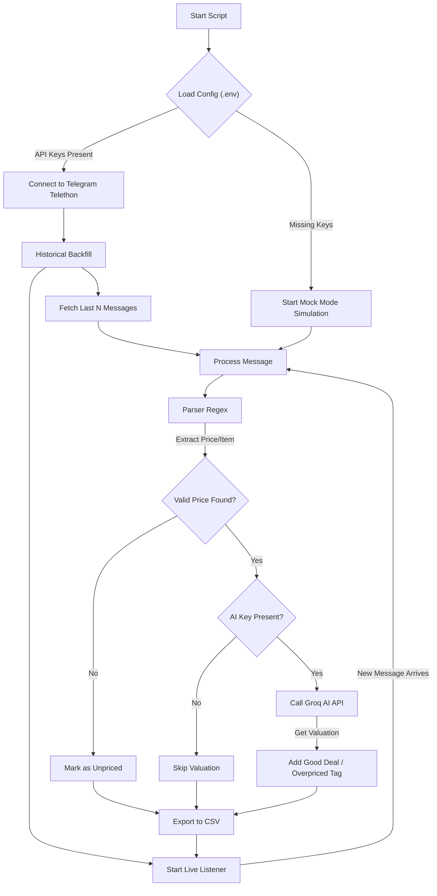

# System Architecture Flowchart

This flowchart illustrates how the Telegram Monitor processes messages from start to finish.

## Key Components

1.  **Telethon Client**: Handles the connection to Telegram's MTProto servers.
2.  **Backfill Module**: Iterates through message history to capture past data.
3.  **Regex Parser**: Extracts structured data (Price, Currency, Item Name) from unstructured text.
4.  **Groq AI**: Provides intelligent valuation logic (Good Deal vs Bad Deal).
5.  **CSV Exporter**: Appends processed data to a local file for analysis.
